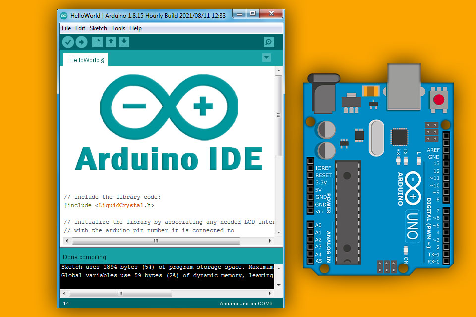

# Arduino Software

Arduino software, also known as the Arduino Integrated Development Environment (IDE), is a user-friendly platform used for programming and uploading code to Arduino-compatible boards. Here are the key features and components of the Arduino software:

## 1. Arduino IDE
- **Code Editor:** The Arduino IDE provides a simple text editor where users write their code, known as sketches, in a language similar to C/C++.
- **Sketchbook:** This is a directory where all Arduino sketches are stored.
- **Library Manager:** Allows users to easily manage and include libraries that provide additional functionality.
- **Serial Monitor:** A tool to communicate with the Arduino board via serial communication, useful for debugging.
- **Board Manager:** Facilitates the installation of support for different types of Arduino boards.
- **Port Selection:** Lets users select the port to which their Arduino board is connected.

## 2. Programming Language
- **Arduino Language:** A simplified version of C/C++, with built-in functions that make it easier to interface with the hardware.
- **Core Libraries:** Includes libraries for handling various hardware components like digital I/O, analog I/O, and communication protocols (e.g., I2C, SPI).

## 3. Uploading Code
- **Compile and Upload:** The IDE can compile sketches and upload them to the connected Arduino board using the built-in bootloader.
- **Bootloader:** A small program pre-loaded on Arduino boards that allows new code to be uploaded without an external programmer.

## 4. Examples and Documentation
- **Built-in Examples:** The IDE includes numerous example sketches that demonstrate how to use various features and libraries.
- **Documentation:** Comprehensive documentation is available to help users understand how to use different components of the IDE and the Arduino language.

## 5. Community and Support
- **Community Contributions:** A vast community of users who contribute libraries, share projects, and provide support.
- **Forums and Tutorials:** Extensive resources available online, including forums, tutorials, and project ideas.

## 6. Cross-Platform
- **Operating Systems:** The Arduino IDE is available for Windows, macOS, and Linux, ensuring wide accessibility.

## 7. Advanced Features
- **Custom Libraries:** Users can create their own libraries to extend functionality.
- **Integrated Debugging (in some versions):** Advanced debugging tools are available in certain versions of the IDE, such as Arduino Pro IDE.

## Alternative Software Options
While the Arduino IDE is the official software, there are alternative options available, such as:
- **PlatformIO:** A professional-grade development environment that supports multiple embedded platforms, including Arduino.
- **Arduino Create:** An online IDE that allows users to write code, save sketches, and upload them to boards directly from a web browser.

Arduino software provides an accessible and powerful environment for developing and uploading code to Arduino boards, making it a popular choice for both beginners and experienced developers in the world of electronics and embedded systems.

