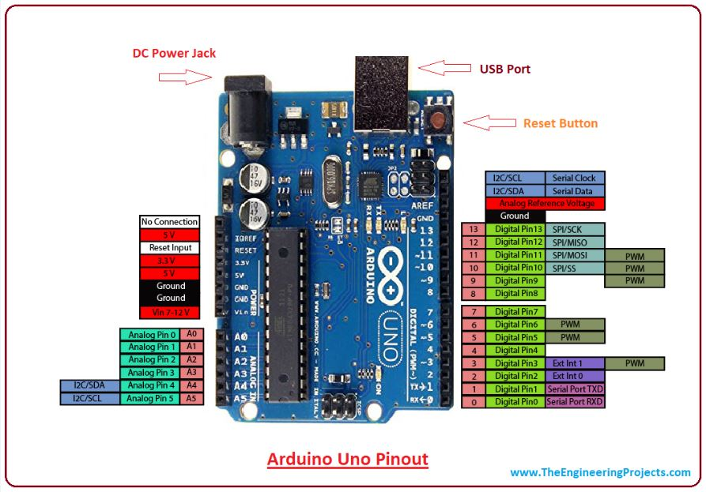

# Arduino Uno R3

The Arduino Uno R3 is a popular microcontroller board based on the ATmega328P microcontroller. It's widely used in electronics projects and prototyping because of its simplicity and ease of use. 

## Key Features
1. **Microcontroller**: ATmega328P.
2. **Operating Voltage**: 5V.
3. **Input Voltage (recommended)**: 7-12V.
4. **Input Voltage (limit)**: 6-20V.
5. **Digital I/O Pins**: 14 (of which 6 provide PWM output).
6. **Analog Input Pins**: 6.
7. **DC Current per I/O Pin**: 20 mA.
8. **DC Current for 3.3V Pin**: 50 mA.
9. **Flash Memory**: 32 KB (ATmega328P) of which 0.5 KB is used by the bootloader.
10. **SRAM**: 2 KB (ATmega328P).
11. **EEPROM**: 1 KB (ATmega328P).
12. **Clock Speed**: 16 MHz.
13. **LED_BUILTIN**: Pin 13.
14. **Dimensions**: 68.6 mm x 53.4 mm.
15. **Weight**: 25 g.

## Connectivity
- **USB Connection**: The Uno can be programmed via a USB connection using the Arduino IDE (Integrated Development Environment). It uses a type B USB cable.
- **Power Jack**: Can be powered using an external power supply (7-12V).
- **ICSP Header**: For programming the microcontroller without a bootloader.
- **Reset Button**: To reset the microcontroller.

## Additional Features
- **ATmega16U2**: Used for USB to serial communication. It replaces the FTDI USB-to-serial driver chip on older versions.
- **Auto-reset**: It can automatically reset the microcontroller before programming.

## Applications
- **Prototyping**: Ideal for developing prototypes of electronic projects.
- **Education**: Used extensively in educational institutions for teaching electronics and programming.
- **DIY Projects**: Popular among hobbyists for creating custom electronic devices and systems.

The Arduino Uno R3 is favored for its balance of features, simplicity, and support from a large community, making it an excellent choice for beginners and experienced developers alike.

