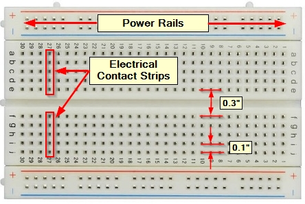
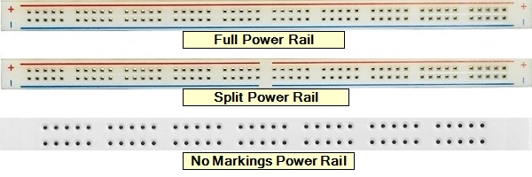
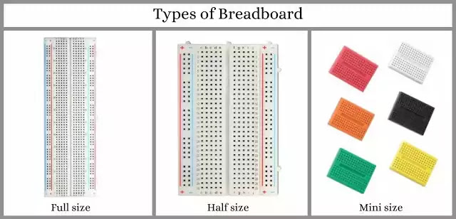
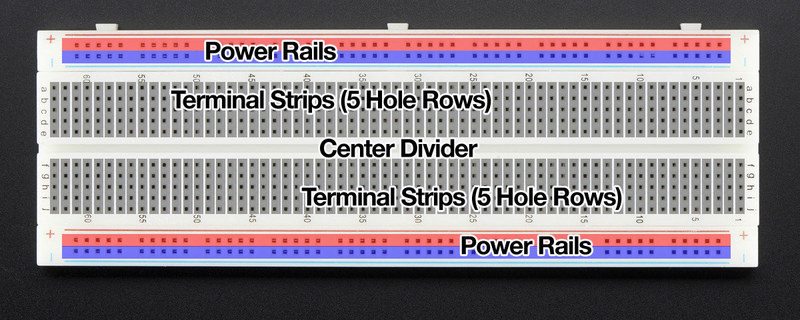

# Breadboard

A breadboard is a construction base used for prototyping electronics. It's a reusable platform that allows you to build and test circuits without soldering. Here are some key features and components of a breadboard:

## Structure
- **Grid of Holes:** A breadboard has a grid of small holes into which electronic components and wires can be inserted. The holes are typically spaced 0.1 inches apart, accommodating standard electronic components.
- **Rows and Columns:** The grid is divided into rows and columns. Each row or column is electrically connected, allowing components inserted into the same row or column to be connected without additional wires.

## Power Rails
- **Horizontal Strips:** Breadboards often have horizontal strips along the top and bottom (or sides) that are used for power distribution. These strips are called power rails and are usually labeled with "+" and "-" to denote positive and negative voltage.

## Terminal Strips
- **Vertical Columns:** The main area of the breadboard consists of vertical columns of holes. Each column is electrically connected internally, but the columns themselves are not connected to each other. Components and wires inserted into these columns are connected.

## Size and Types
- **Full-Size:** These are larger breadboards with more rows and columns, suitable for more complex circuits.
- **Half-Size and Mini:** These are smaller versions of breadboards, used for simpler circuits or when space is limited.
- **Solderless vs. Solderable:** Most breadboards are solderless, allowing components to be inserted and removed easily. Solderable breadboards are also available for more permanent connections.

## Uses
- **Prototyping:** Breadboards are primarily used for creating prototypes of electronic circuits. They allow for easy modifications and adjustments.
- **Educational Purposes:** Breadboards are widely used in educational settings to teach electronics and circuit design.
- **Testing and Debugging:** Engineers and hobbyists use breadboards to test and debug circuits before creating a permanent version.

## Components
- **Jumpers:** These are wires used to connect different parts of the circuit on a breadboard.
- **Electronic Components:** Resistors, capacitors, LEDs, transistors, and other components can be inserted into the breadboard.

## Advantages
- **Reusable:** Components can be easily inserted and removed, making breadboards highly reusable.
- **No Soldering Required:** This makes it easy to experiment and modify circuits.
- **Easy to Use:** Breadboards are straightforward to use, making them accessible for beginners.

## Disadvantages
- **Not Suitable for High-Frequency Circuits:** The parasitic capacitance and inductance of breadboards can interfere with high-frequency signals.
- **Less Durable:** The connections can become loose with frequent use.

A breadboard is an essential tool for anyone working with electronics, from beginners learning the basics to professionals developing new circuits.

