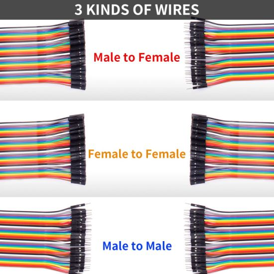

# Jumper Wires

Jumper wires are short electrical wires with connectors at both ends. They are used to create temporary or semi-permanent connections between electronic components and devices, often on a breadboard or other prototyping setup. Here are some key features and uses of jumper wires:

## Features

1. **Connectors**: Jumper wires typically have male or female connectors on each end. Male connectors are pins that fit into sockets, and female connectors are sockets that receive pins.
2. **Insulation**: They are insulated with plastic to prevent short circuits and are often color-coded for easy identification of connections.
3. **Lengths**: They come in various lengths to accommodate different distances between components on a breadboard or circuit.

## Types

1. **Male to Male**: Both ends have pins. Commonly used for connecting different points on a breadboard or to microcontroller headers.
2. **Male to Female**: One end has a pin and the other end has a socket. Useful for connecting sensors or other modules with pin headers to breadboards or microcontrollers.
3. **Female to Female**: Both ends have sockets. These are used to connect components with pin headers directly.

## Uses

1. **Prototyping**: Jumper wires are essential in creating and testing circuits on breadboards during the prototyping phase.
2. **Education**: They are widely used in educational settings for teaching electronics and circuit design.
3. **Testing**: Jumper wires allow for easy modification and troubleshooting of circuits.
4. **Connections**: They can connect various electronic components such as sensors, LEDs, resistors, microcontrollers, and other modules without soldering.

## Benefits

1. **Reusable**: They can be used multiple times, making them cost-effective for prototyping and testing.
2. **Flexible**: Easily reconfigurable connections without the need for soldering.
3. **Time-Saving**: Simplifies the process of assembling and modifying circuits.

Jumper wires are an indispensable tool for anyone working with electronics, from hobbyists and students to professional engineers.

