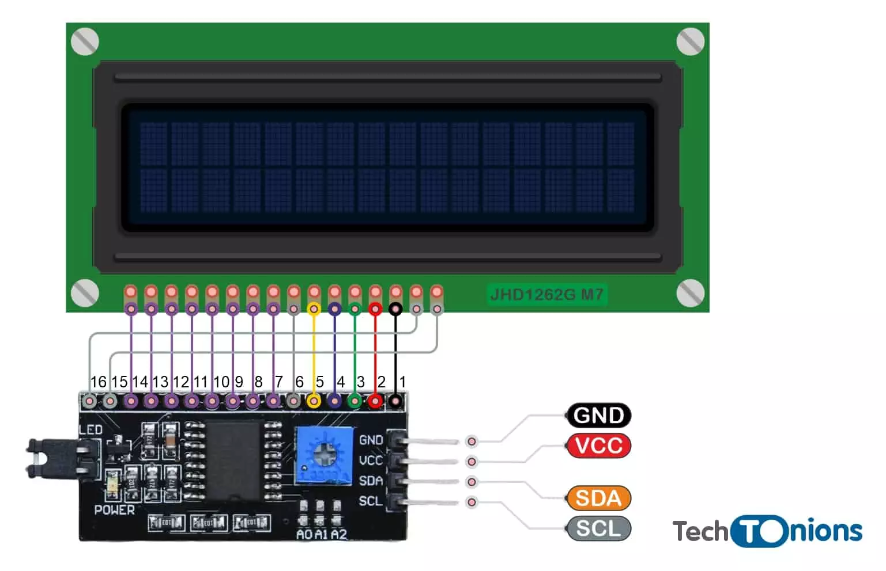
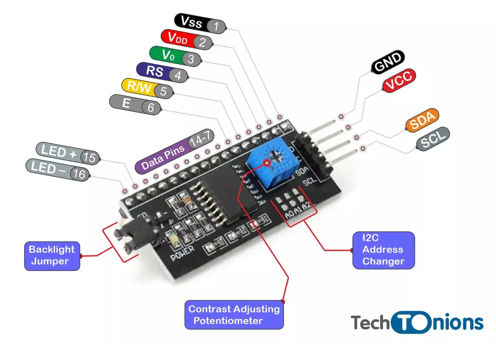

# LCD 16x2 with I2C Interface

An LCD (Liquid Crystal Display) 16x2 with an I2C interface is a common type of display used in various electronic projects, particularly with microcontrollers like Arduino. Here’s an overview:

## LCD 16x2
- **16x2**: This indicates that the display has 2 rows, each capable of displaying 16 characters, for a total of 32 characters.
- **Characters**: Each character is typically a 5x8 dot matrix.

## I2C Interface
- **I2C (Inter-Integrated Circuit)**: This is a communication protocol that allows multiple peripherals to be connected using just two wires: SDA (Serial Data) and SCL (Serial Clock).
- **Advantages**:
  - **Reduced Pin Count**: Only requires two pins for communication instead of the numerous pins needed for parallel communication.
  - **Addressable**: Multiple devices can be connected on the same bus and can be addressed individually.
  - **Ease of Use**: Simplifies wiring and reduces the number of GPIO pins used on a microcontroller.

## Key Components
1. **LCD Module**: The screen itself, which displays characters.
2. **I2C Adapter**: A small PCB attached to the LCD that converts I2C signals to parallel signals required by the LCD.
3. **Potentiometer**: Often included to adjust the contrast of the display.
4. **Backlight**: LEDs that illuminate the screen, often controlled by software or hardware settings.

## How It Works
1. **Connection**:
   - Connect the I2C adapter's VCC and GND to the microcontroller's power supply.
   - Connect the SDA and SCL lines to the corresponding I2C pins on the microcontroller.
2. **Communication**:
   - The microcontroller sends data to the LCD over the I2C bus.
   - The I2C adapter interprets these signals and controls the LCD accordingly.

## Typical Applications
- **Microcontroller Projects**: Frequently used with Arduino, Raspberry Pi, and other microcontrollers for displaying information.
- **Embedded Systems**: Common in various embedded systems for user interfaces.
- **Educational Purposes**: Popular in educational kits and projects for learning about electronics and programming.

