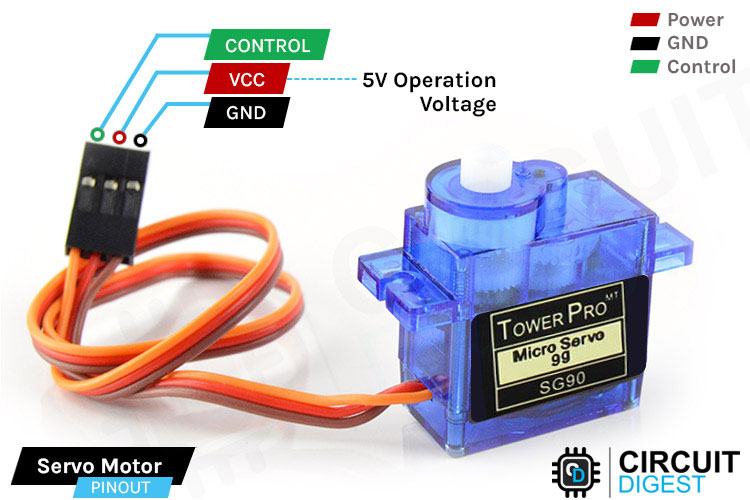

# Servo Motor

A servo motor is a type of motor that is controlled by a feedback signal to achieve precise control of angular or linear position, velocity, and acceleration. Unlike regular motors, which simply spin when power is applied, servo motors incorporate a feedback mechanism that continuously monitors the position of the motor and adjusts the input to maintain the desired position or speed. 

## Key Components and Features

1. **Motor**: Typically, a DC or AC motor forms the core of a servo motor.
2. **Control Circuit**: The control circuit receives the input signal (desired position) and compares it with the feedback signal (actual position). It then adjusts the motor's movement to reduce the difference between the two signals.
3. **Feedback Mechanism**: This can be an encoder or a potentiometer that provides the actual position or speed of the motor to the control circuit.
4. **Drive**: The drive converts the control signals into the appropriate electrical signals to power the motor.
5. **Gearbox**: Many servo motors include a gearbox to increase torque and reduce speed for more precise control.

## Types of Servo Motors

1. **AC Servo Motors**: These use alternating current and are known for high efficiency and precision. They are typically used in industrial applications.
2. **DC Servo Motors**: These use direct current and are simpler and cheaper. They are commonly used in smaller applications like hobby robotics.
3. **Positional Rotation Servo**: This type of servo has a limited range of rotation (usually 180 degrees) and is commonly used in applications where precise angle control is needed, such as in radio-controlled cars or planes.
4. **Continuous Rotation Servo**: This type can rotate continuously in either direction and is used in applications requiring full rotation, such as conveyor belts.

## Applications

- **Robotics**: For precise movement and positioning.
- **CNC Machinery**: For accurate cutting and shaping.
- **Aerospace**: For control surfaces in aircraft.
- **Consumer Electronics**: In devices like CD/DVD players, cameras, and printers.
- **Automated Manufacturing**: For tasks that require precise control of movement and position.

Servo motors are essential in systems requiring high precision and repeatability, making them critical components in modern automation and control systems.

